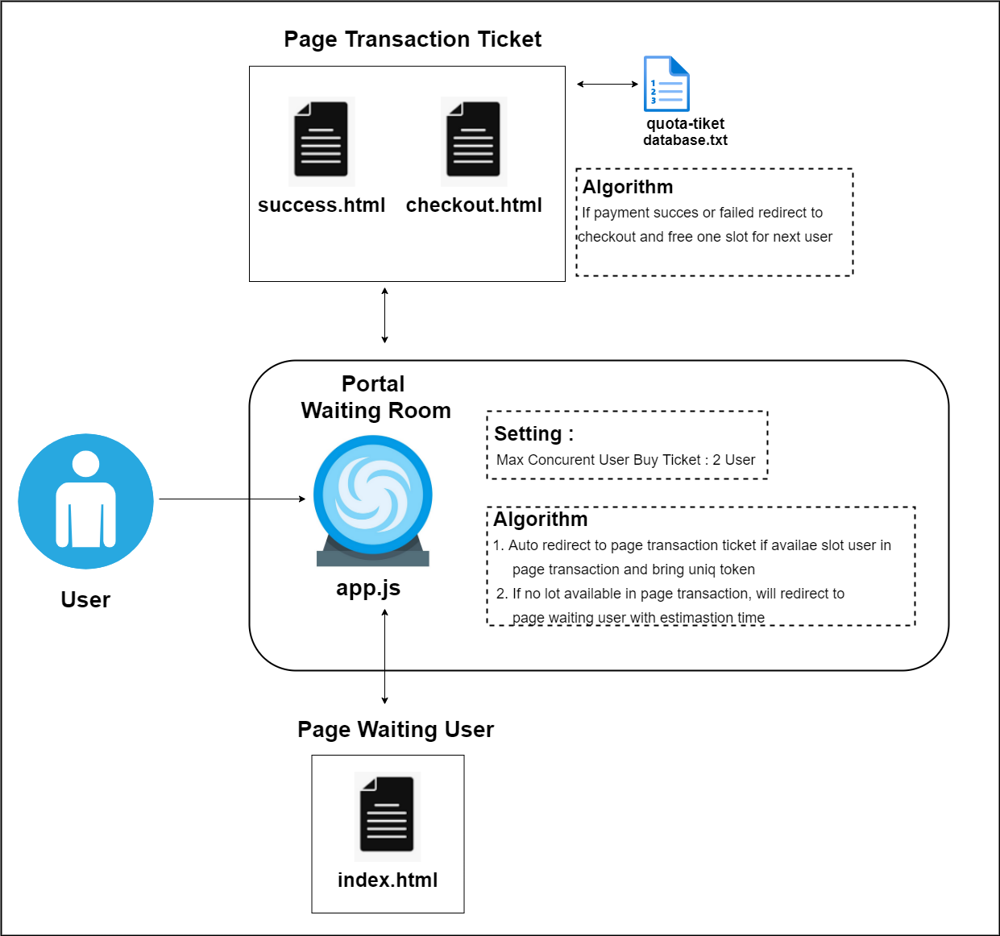
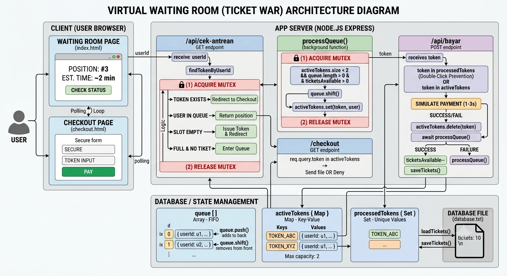
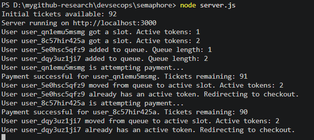
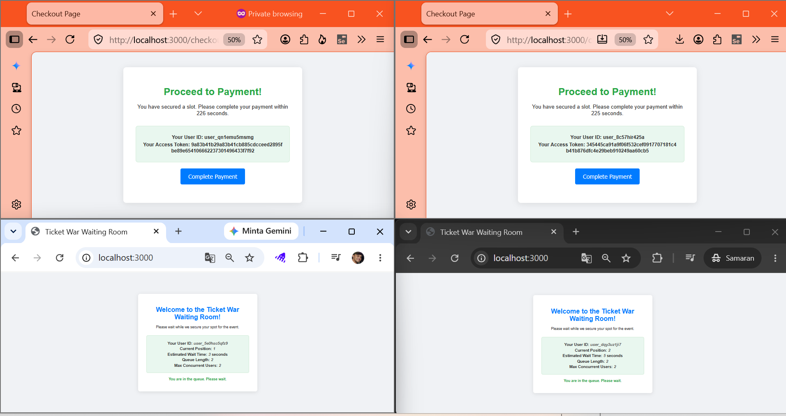

# Unlocking the Secrets of Ticket War Architecture

Have you ever wondered how major ticketing platforms handle millions of fans clicking "Buy Now" at the exact same millisecond without crashing? The secret lies in a smart queuing architecture. This project demonstrates how to build an efficient, crash-proof waiting room and checkout flow using Node.js, Express, and a semaphore pattern.


## Table of Contents
- [Unlocking the Secrets of Ticket War Architecture](#unlocking-the-secrets-of-ticket-war-architecture)
  - [Table of Contents](#table-of-contents)
  - [Introduction: Semaphore \& The Ticket War Case Study](#introduction-semaphore--the-ticket-war-case-study)
  - [System Architecture](#system-architecture)
    - [High-Level Architecture](#high-level-architecture)
    - [Detailed Component Architecture](#detailed-component-architecture)
  - [Evidence \& Interface Walkthrough](#evidence--interface-walkthrough)
    - [Waiting Room Queue Screen](#waiting-room-queue-screen)
    - [Payment \& Checkout Screen](#payment--checkout-screen)
  - [How to Run the Application](#how-to-run-the-application)
  - [Demo Video](#demo-video)


## Introduction: Semaphore & The Ticket War Case Study

During a high-demand event (such as a popular music concert or sports match), thousands or millions of users try to access the payment gateway at the same time. This is called a **Ticket War**. If the server processes everyone simultaneously:
1. The database will get overloaded and crash.
2. Double-booking bugs can occur, causing more tickets to be sold than are actually available.

To solve this, we use the **Semaphore Pattern**. A Semaphore limits the number of users who can enter the checkout area at the same time (`MAX_CONCURRENT` is set to 2 in this project).
- When a user enters the site, they check the queue status (`/api/cek-antrean`).
- If there is an available checkout slot, they get an **Access Token** and proceed to checkout immediately.
- If all slots are full, they are placed in a waiting queue.
- Once an active user finishes their payment or times out, the next user from the queue is moved to the checkout slot.
- A **Mutex** is used in the backend to make sure states are updated safely without race conditions.


## System Architecture

We have prepared visual diagrams to explain the flow of our high-concurrency ticket war system.

### High-Level Architecture
Below is the main diagram showing the structural flow of our queue and token management:



**Diagram Explanation:**
- **Users**: Multiple clients connect to the web app.
- **Waiting Room / Queue System**: Users are held in a queue if the active slots are full.
- **Semaphore / Active Tokens**: Limits checkout concurrency to a maximum of 2 users at a time.
- **Database (`database.txt`)**: Stores the total available ticket count. Every successful checkout decreases this count.

### Detailed Component Architecture
Here is the detailed flow diagram showing API requests and token validation:



**Diagram Explanation:**
- **Step 1: Check Queue (`/api/cek-antrean`)**: The client browser polls this API every 2 seconds. The server checks the queue length and active token map.
- **Step 2: Token Issuance**: If the active slot count is below `MAX_CONCURRENT` (2) and tickets are still available, the server issues a cryptographically secure 32-byte token and redirects the user to `/checkout?token=<token>`.
- **Step 3: Access Validation**: The checkout page checks if the token is active. If valid, the user gets 300 seconds (5 minutes) to complete the transaction.
- **Step 4: Payment Completion (`/api/bayar`)**: When the user clicks "Complete Payment", the server processes it, decrements the ticket count in `database.txt`, removes the token from the active list, and triggers `processQueue()` to let the next waiting user in.


## Evidence & Interface Walkthrough

Here is the actual implementation of the interface showing how it works in practice:

### Waiting Room Queue Screen
When users join during a traffic spike, they are queued and receive real-time estimates of their position:



**Image Explanation:**
- This screen displays the user's auto-generated User ID.
- It shows their current position in the queue and the estimated wait time.
- The browser automatically polls the server until a slot becomes available.

### Payment & Checkout Screen
Once a slot opens up, the user is redirected to the secure checkout page:



**Image Explanation:**
- The page shows the access token and the countdown timer (300 seconds).
- The "Complete Payment" button triggers the transaction.
- Double-clicking is prevented on both the frontend and backend to avoid duplicate payments.


## How to Run the Application

Follow these simple steps to run this project on your local machine:

1. **Install Dependencies**  
   Ensure you have [Node.js](https://nodejs.org/) installed. Run:
   ```bash
   npm install
   ```

2. **Configure Available Tickets**  
   Open [database.txt](file:///d:/mygithub-research/devsecops/semaphore/database.txt) and set the ticket count (e.g. `tickets: 90`).

3. **Start the Server**  
   Run the following command to start the Express server:
   ```bash
   node server.js
   ```

4. **Access the Application**  
   Open your browser and navigate to:
   ```
   http://localhost:3000
   ```


## Demo Video

You can view a full demonstration of the system in action here:
- https://www.youtube.com/watch?v=A5TFyuUMFsA
